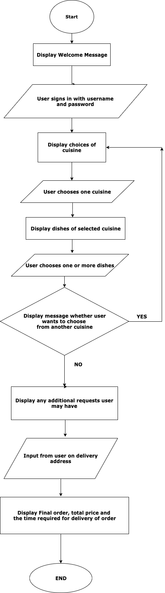
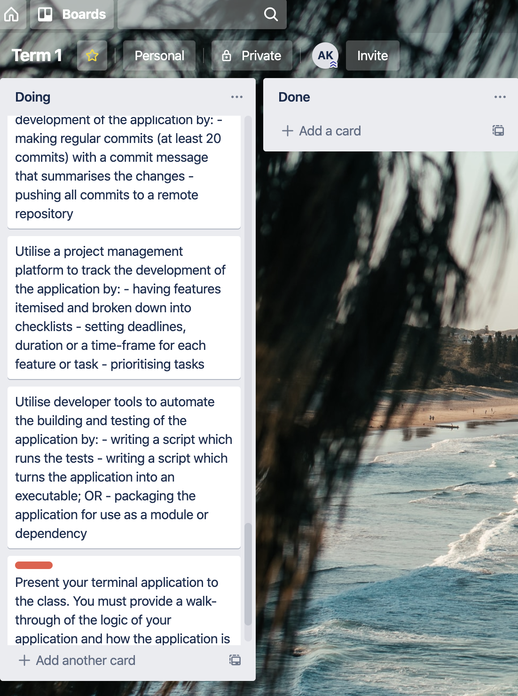
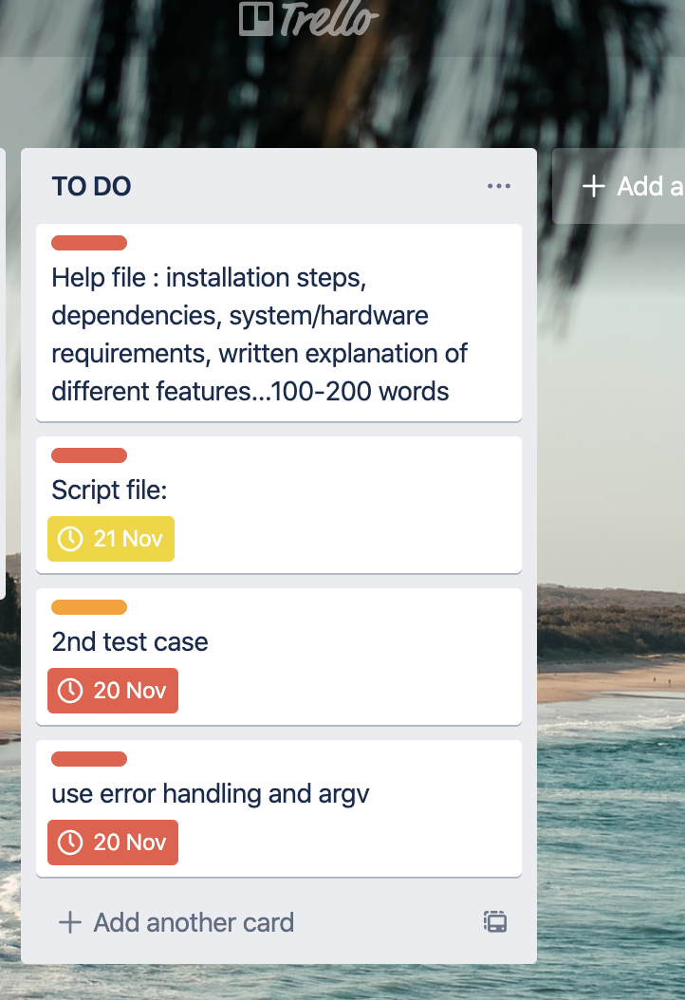
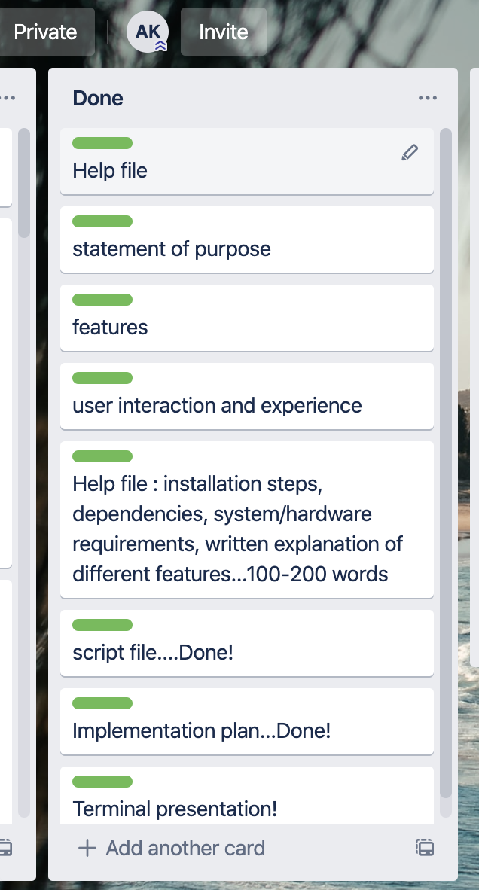

# T1A2 Terminal Application - Online food order app 'Super Eats'

SOFTWARE DEVELOPMENT PLAN

SCOPE: The scope of this 'Super Eats' app is to allow the user to order food online from nearby food-courts, by selecting dishes from cuisines of their choice.

STATEMENT OF PURPOSE:
    What the application will do:
    This application is an online food delivery app called 'Super Eats'. It enables users to order food from stores within a food court. They can choose from a variety of dishes from various cuisines. The final cart shows them what they have ordered along with the total cost. There is also an option to mention any additional requests such as spice levels, no onions etc. The application then asks for an address to which the food has to be delivered. It also gives the time it would take for delivery.

THE PROBLEMS THIS APP SOLVES AND WHY I AM DEVELOPING IT:

1. Food delivery apps have gained so much importance because of smartphone dependence. Nowadays people dont have time to go outside for food. Online ordering mainly solves mobility problems. Customers can order from anywhere - while sitting on a train, in a classroom, while working late from office, or even if they are just bored of eating home coked food! 
2. Another problem it solves is the misunderstandings that occur when ordering via calling the restaurant directly. Restaurant noises, phone connectivity can lead to confusions which is avoided by online ordering as it is directly specified by the customer
3. Customers have much so much more choice in an online food app, they can choose between different cuisines/dishes
4. There is no minimum order quantity in this app. It doesnt matter if they can order for one, or order for a house party. 
5.Restaurants during holiday times/office lunch breaks can get crowded and long waiting lines are usual. Order online from the comfort of home or work!

TARGET AUDIENCE:
Hungry? Busy...or lazy to cook? Vegetarian/vegan friendly? This app appeals to people of all ages because it is so convenient, painless to order, and quick. It mainly is useful for office goers who dont want to step out of office and wait in long queues to grab lunch. This app has dishes available from many of the restaurants within the CBD

HOW TARGET AUDIENCE WILL USE IT:    
The current version of the application is a prototype to be executed on the terminal. The long term goal is to publish it in the iOS or Android app store and can be accesed via browser too. Users need to sign up with their email ids when they use the app for the first time after which they can easily log in whenever ordering. They can create a profile with their favourite cuisines saved for future use. The 'Menu' icon gives them the choices of cuisines which they initially choose, after which they have the individual dishes to choose from a range of entrees, mains and desserts. The prices are mentioned alongside the dishes. If the user has any requests such as wanting extra napkins, reducing spice levels etc, there is an 'additional requests' column where they can write it down. Finally, their delivery address is to be given. The 'cart' then shows the final order. Total price and delivery time is then mentioned to the user

FEATURES:
1. Mix and match cuisines: 
a) Super Eats allows users to mix and match cuisines and dishes while ordering. This is achieved through effective use of variables and loops. 
b) This app minimises user input errors as it uses multi-select option from TTY-Prompt Gem where the user only has to select using the space bar and then press enter. Manually typing the input   
c) User friendly error message displayed for invalid inputs.

2. Cart and final costs:
a) The cart shows the user's final order, total price by compiling and displaying all the dishes across cuisines that the user chose. This feature was developed with the help of creating an empty array variable which keeps appending user's input as they order. The total price of the order is obtained by creating variables and defining methods to get price of single dish and another method to get the price of all the dishes ordered.

3. Delivery time:
a) The delivery time is given to the user based on the total items ordered. It is calculated by writing conditions using comparison operators between number of items and the minutes taken to deliver.

4. Log-in feature using username and password:
a) This app allows the user to proceed with ordering only after they have signed into the app. If username or password are incorrect, the user is informed via an error message. 
b) This feature was developed using if/elsif statements and running a loop while creating a variable called username_validity. The variable is selected true when username and password both are correct and it becomes false when either username or password are incorrect.

USER INTERACTION AND EXPERIENCE:
Super Eats app is quite descriptive and user-friendly at every step. 
1. Once the program starts in terminal, the user is asked for the username and password. 
2. After user is logged in successfully, the options for cuisines(Italian,Mexican,Indian) show up and the user has to type in the desired option. By using || operators, upcase, downcase and  capitalize inputs are all taken care of. Errors are handled in this step by way of displaying an error message when anything other than the options are typed.
3. The dishes under the chosen cuisine show up and the user can select multiple dishes in one go, which are then displayed.
4. User is asked if they would like to order food from another cuisine. If user types yes, the cuisines are displayed repeatedly and the process continues. If the user types in no, the next stage of the order comes up.
5. The user is then asked if they have any additional requests, which they can type in.
6. The next step asks for the user's address input.
7. The user is then displayed with the final order, final price, and the time for delivery of food.

CONTROL FLOW DIAGRAM:

IMPLEMENTATION FILE:
Below is the implementation plan in tabular format

#Help file:
Software pre-requisites:
1. Ruby version 2.5.1 
    a) For Windows users -  follow https://rubyinstaller.org/ to install Ruby
    b) For Mac OSX -  You will need to install HomeBrew as a Package Manager. Follow ruby-lang.org/en/documentation/installation/#homebrew
    or steps below to install Ruby on Mac
    brew install rbenv
    brew upgrade rbenv
    rbenv -v
    rbenv init
    rbenv install 2.5.1
    ruby -v
    rbenv install --list
2. Install an IDE - I am using Visual Studio Code. Feel free to use a convenient IDE.
https://code.visualstudio.com/docs/setup/setup-overview
Follow the platform specific guides for: macOS, Linux, Windows

Gem installation:
1. TTY-prompt: to install TTY-prompt, type 
sudo gem install tty-prompt
In order to start asking questions on the command line, create prompt:
require "tty-prompt"
prompt = TTY::Prompt.new

2. Colorize :to install Colorize, type
sudo gem install colorize
In ruby file,
require 'colorize' - Extends String class; 
require 'colorized_string' - add ColorizedString class

3. Artii: to install artii,type
sudo gem install artii
In ruby file,
require "artii"

4.Change to dist folder
5.Run SuperEats.rb in terminal

Features:
1.Log-in with username and password
2.Cart showing total order
3.Delivery time given to user
4.Mix and match cuisines
#Test case outline
The first test case we applied is for the successful login by using the correct username and password followed by the unsuccessful login by using correct username but incorrect password. I defined a method called log_in with username and password as parameters. Using if/else statements, I passed in the username and its corresponding values as passwords to be returned as true, and any other values as false. For the tests, I defined a method called test_successful_login, inside which I gave the previously saved values for username and password. I then mentioned that the expected_result is true(since I had passed the correct values) and the actual_result as the method log_in. Using if/else statements, if the expected_result equalled actual_result then it would show up as pass, or fail. On calling method test_successful_login, we got a Pass. Similarly for testing a negative case, I defined a method called test_unsuccessful_login. I then used a random username and password. I knew the expected_result was false based on the values given in method log_in. As tested in the positive case, on calling method test_unsuccessful_login it was a Pass. 

#Trello screenshots
Here are screenshots from my project management application Trello
 
 
 
